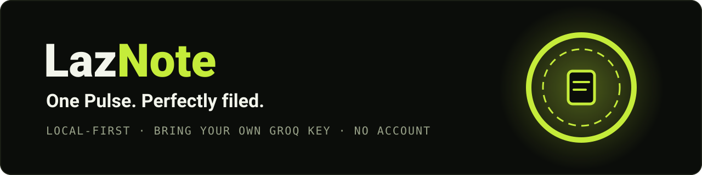
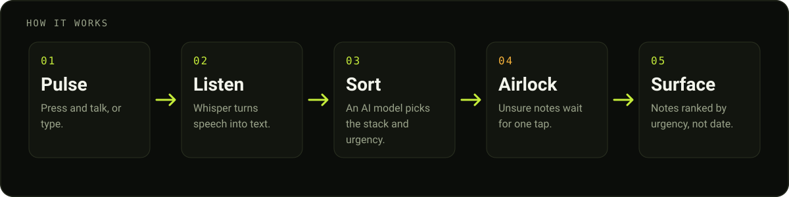
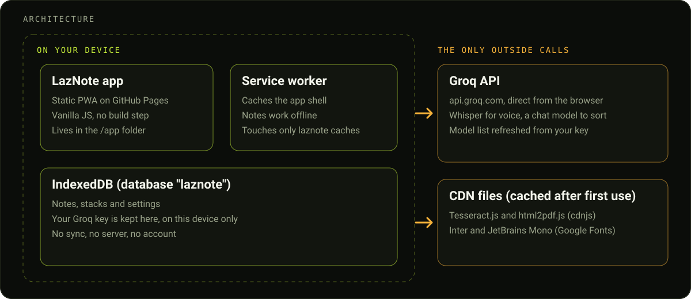

# LazNote

## What it is

LazNote is a local-first notes app. Speak it or type it, and AI files the note into the right stack and ranks everything by urgency, so you see what needs attention now. There are no tags, folders or accounts. Notes live on your device and you bring your own Groq key for the AI.

- **Voice first:** talk for as long as you like and LazNote splits it into separate notes.
- **Urgency, not date:** the Notes view puts what is burning at the top.
- **Airlock:** notes the AI is unsure about wait there with its reasoning for a one-tap confirm.
- **Cards, Stacks, Scan, Archive:** browse by card, by stack, scan photos with the camera, and find duplicates to merge.

## Live URLs and install

| | |
|---|---|
| Landing page | https://johnlaz.github.io/laznote/ |
| App | https://johnlaz.github.io/laznote/app/ |

Only the app is installable. Open the app URL, then:

- **iPhone / iPad:** Share, then Add to Home Screen
- **Android / Chrome:** menu, then Install app
- **Desktop Chrome / Edge:** install icon in the address bar

## Quick start



1. Open the app and finish the short tour.
2. Get a free key at https://console.groq.com/keys and paste it in Settings, then Groq.
3. Press the Pulse button and talk, or type, then save.

Without a key you can still write and file notes by hand. The AI sorting, voice and photo scan need a key.

## AI and model setup

LazNote uses Groq with your own key. There is nothing to pick: the app asks Groq which models your key can use and chooses the best one for each job (sorting, logic, photo scan, voice). It does this when you save a key, about once a day when you open the app, and when you tap **Settings, Groq, Refresh models**. If Groq retires a model, the app checks the list again, switches and retries on its own. Your last good choices are kept so the app still works offline.

## Data and privacy

- Notes, stacks, settings and your Groq key are stored in your browser's IndexedDB on this device. There is no LazNote server and no account.
- What you send to the AI (the text of a note, a recording, or a photo) goes straight from your browser to `api.groq.com`.
- The app also loads Tesseract.js and html2pdf.js from cdnjs and the Inter and JetBrains Mono fonts from Google Fonts. After the first online use they are cached for offline.
- Camera scan and PDF export need those files. Offline, the first scan or export may not work until they have been loaded once.
- No cookies and no analytics.

## Repo layout



```
/README.md
/index.html            landing page (plain site, no manifest, no service worker)
/sw.js                 one-time cleanup of an old service worker; nothing registers it
/media/                landing page background videos
/docs/                 banner.svg, how-it-works.svg, architecture.svg
/app/index.html        the app shell
/app/app.js            app logic
/app/import.js         import and share handling
/app/styles.css        styles
/app/manifest.webmanifest
/app/sw.js             app service worker (cache "laznote-v<version>")
/app/icon-192.png      maskable-safe
/app/icon-512.png      maskable-safe
/app/shot-notes-narrow.png   390x844
/app/shot-notes-wide.png     1280x800
/app/splash.mp4        launch splash
```

The app is a few plain files with no build step.

## Deploy and update

The site is served by GitHub Pages from the root of this repo. To release a change:

1. Edit the files and commit to the default branch.
2. Bump the version in three places together: `APP_VER` in `app/app.js`, `VERSION` in `app/sw.js`, and the stamp in `app/index.html`.
3. Push. Installed copies pick up the new version the next time they are opened online.

The service worker only manages caches that start with `laznote-`, because every app on `johnlaz.github.io` shares one origin.

## Changelog

| Version | Date | Changes |
|---|---|---|
| 4.7.0 | 2026-10-08 | Cleaner repo layout. App service worker no longer deletes other apps' caches, loads new releases first and caches Tesseract, html2pdf and fonts after first use. Maskable icons redrawn. Real screenshots. Landing page is now a plain site. Version stamp unified. |
| 4.5 | n/a | AI models picked automatically from your Groq key and refreshed daily. "Blades" renamed "Notes". Undo for trash. Desktop layout and button fixes. |
| 4.0 | n/a | Capture sheet with pinned buttons, clearer note actions, six-card tour, merge with undo, desktop three-column mode and keyboard shortcuts. |

## Studio

Built by LAZLAB Creations. Questions: lazlab.io@gmail.com

© 2026 LAZLAB Creations. All Rights Reserved.
